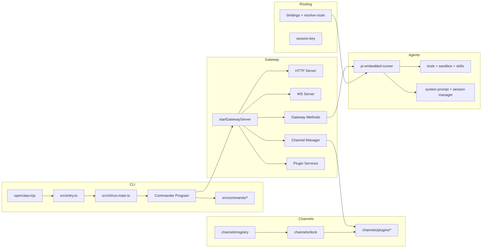

# 🦞 OpenClaw —— 个人 AI 助手（中文版）

<p align="center">
    <picture>
        <source media="(prefers-color-scheme: light)" srcset="https://raw.githubusercontent.com/openclaw/openclaw/main/docs/assets/openclaw-logo-text-dark.png">
        
    </picture>
</p>

<p align="center">
  <a href="https://github.com/openclaw/openclaw/actions/workflows/ci.yml?branch=main"></a>
  <a href="https://github.com/openclaw/openclaw/releases"></a>
  <a href="https://discord.gg/clawd"></a>
  <a href="LICENSE"></a>
</p>

## 项目简介
OpenClaw 是一个运行在你自己设备上的“个人 AI 助手”。它通过 **Gateway** 统一管理多渠道消息、工具调用、会话与插件，并把结果回传到你日常使用的聊天渠道（WhatsApp/Telegram/Slack/Discord/Google Chat/Signal/iMessage 等）。

如果你想要一个**本地可控、随时在线、响应迅速**的私人助手，这是一个完整且可扩展的方案。

- 官网: https://openclaw.ai
- 文档: https://docs.openclaw.ai
- 上手: https://docs.openclaw.ai/start/getting-started
- 更新: https://docs.openclaw.ai/install/updating

## 功能说明（高层概览）
- **Gateway 控制平面**：统一管理会话、通道、工具、事件与配置。
- **多渠道接入**：内置 WhatsApp/Telegram/Slack/Discord/Google Chat/Signal/iMessage 等通道；扩展通道通过插件接入。
- **Agent 运行时**：模型选择、认证轮换、系统提示词构建、会话与上下文维护。
- **工具系统**：浏览器/节点/画布/cron/会话等工具能力。
- **插件系统**：可加载外部扩展（含通道与能力）。
- **Control UI + Canvas**：通过浏览器 UI 与画布进行可视化协作。

## 技术栈
- 语言: TypeScript (ESM)
- 运行时: Node.js >= 22
- CLI: Commander
- Web/WS: Node HTTP/HTTPS + ws
- Agent: pi-* 系列运行时
- 主要依赖: express、hono、sharp、markdown-it、croner 等

## 架构图


## 项目结构（目录说明）
- `src/cli`：CLI 基础设施与参数解析
- `src/commands`：CLI 命令实现
- `src/gateway`：Gateway 核心（HTTP/WS/鉴权/通道/插件）
- `src/channels`：通道 docking + 注册表
- `src/routing`：路由与 session key 生成
- `src/agents`：Agent 运行时与工具系统
- `src/plugins`：插件加载与服务
- `extensions/`：外部扩展包（通道/功能）
- `apps/`：macOS/iOS/Android 客户端
- `ui/`：Web UI
- `docs/`：文档

## 核心流程讲解（高层）
1) **CLI 启动**：`openclaw.mjs` -> `src/entry.ts` -> `src/cli/run-main.ts` -> 命令注册与执行。
2) **Gateway 启动**：配置校验/迁移 -> 插件加载 -> 通道管理 -> HTTP/WS 启动 -> 维护与热重载。
3) **消息路由**：根据 channel/account/peer/guild/team 绑定规则解析 agentId 与 sessionKey。
4) **Agent 运行**：选择模型与认证 -> 构建 system prompt -> 加载会话 -> 工具注入 -> 输出回传。

## 快速开始（推荐）
运行时要求: **Node >= 22**

```bash
npm install -g openclaw@latest
# or: pnpm add -g openclaw@latest

openclaw onboard --install-daemon
```

更多完整引导: https://docs.openclaw.ai/start/getting-started

## 从源码运行（开发）
```bash
git clone https://github.com/openclaw/openclaw.git
cd openclaw

pnpm install
pnpm ui:build
pnpm build

pnpm openclaw onboard --install-daemon
pnpm gateway:watch
```

## 如何测试
```bash
pnpm test
# 覆盖率
pnpm test:coverage
```

## 未来扩展方向 / TODO
- 更完整的 WS 方法调用链文档化
- 通道插件的热重载与运行态诊断能力
- 更系统的多通道可观测性指标（启动/断开/错误）

## 相关文档入口
- 总览: https://docs.openclaw.ai
- Gateway: https://docs.openclaw.ai/gateway
- Channels: https://docs.openclaw.ai/channels
- Tools: https://docs.openclaw.ai/tools
- Nodes: https://docs.openclaw.ai/nodes
- Security: https://docs.openclaw.ai/gateway/security
- Getting Started: https://docs.openclaw.ai/start/getting-started

