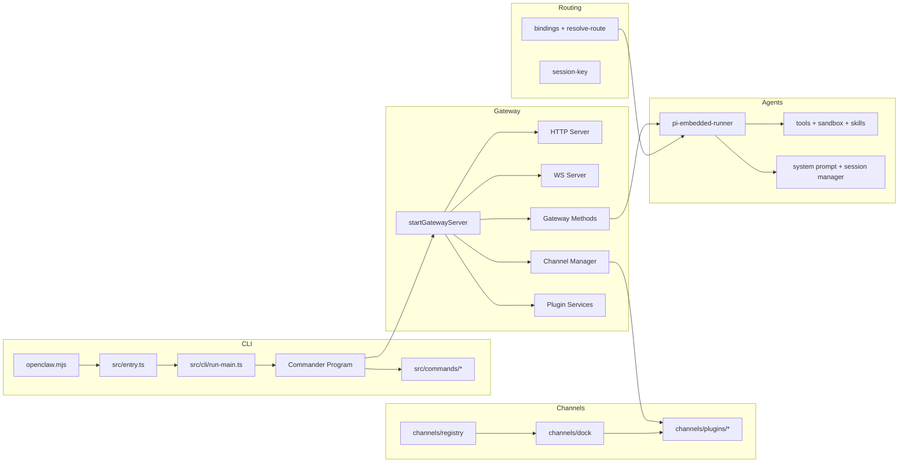

# OpenClaw 项目架构与技术栈（更新版）

> 已读范围扩展到 `src/gateway/*`, `src/channels/*`, `src/routing/*`, `src/agents/pi-embedded-runner*`。

## 项目定位（已验证）
- 类型: Node.js/TypeScript 的 CLI + 网关服务（Gateway）+ 多渠道消息接入 + 插件系统 + Agent/模型运行时。
- 入口: `openclaw.mjs` -> `dist/entry.js`（构建产物） -> `src/entry.ts`（源码入口）。
- 运行时: Node >= 22（见 `package.json` engines）。
- CLI 框架: Commander（`src/cli/program/*`）。

## 技术栈（已验证）
- 语言: TypeScript (ESM)
- 运行: Node.js 22+
- CLI: `commander`
- Web/HTTP: `express`, `hono`, `ws`, Node http/https
- 渠道 SDK: `@whiskeysockets/baileys`(WhatsApp Web), `grammy`(Telegram), `@slack/bolt`/`@slack/web-api`, `discord-api-types`, `@line/bot-sdk`
- 媒体/文档: `sharp`, `pdfjs-dist`, `markdown-it`
- 定时任务: `croner`
- 插件: `jiti`（运行时加载）
- Agent 核心: `@mariozechner/pi-*` 体系（pi-agent-core / pi-coding-agent / pi-ai）

## 架构概览（已验证 + 局部推断）
- CLI 层: `src/cli`, `src/commands`
- 网关层: `src/gateway`（HTTP/WS/鉴权/插件/通道编排/会话）
- 通道层: `src/channels` + `src/*` 各渠道实现（telegram/discord/slack/signal/imessage/web/whatsapp/line 等）
- 路由层: `src/routing`（session key + binding 路由）
- Agent/模型层: `src/agents`（嵌入式 agent 运行、工具、系统提示词、会话管理）
- 配置/会话: `src/config`, `src/sessions`
- 基础设施: `src/infra`, `src/logging`, `src/terminal`, `src/process`, `src/security`
- 插件/扩展: `src/plugins`, `extensions/*`
- UI: `ui/`（前端构建），`apps/*`（macOS/iOS/Android）

## Gateway 运行结构（已验证）
- `startGatewayServer()` 负责配置校验、插件加载、通道管理、HTTP/WS 服务器与周边服务启动。
- Gateway 通过 WS 暴露内部方法集（`listGatewayMethods` + plugin 扩展）。
- Gateway 通过 HTTP 提供 hooks、工具调用、OpenAI/OpenResponses 兼容接口、Control UI、Canvas Host 等。

## Channels 结构（已验证）
- `src/channels/registry.ts`: 核心通道元数据（顺序、label、文档路径等）。
- `src/channels/dock.ts`: 轻量 docking 配置（能力、mention 规则、threading、allowlist 格式化等）。
- `src/channels/plugins/*`: 重量级通道插件注册与实现（运行时加载，避免在共享代码中过早引入）。

## Agent 运行结构（已验证）
- `src/agents/pi-embedded-runner/*`: 核心 agent 运行流程。
- 负责: 模型/认证选择、会话管理、工具注入、系统提示词构建、sandbox/skills、流式输出订阅。

## 架构图（Mermaid）

