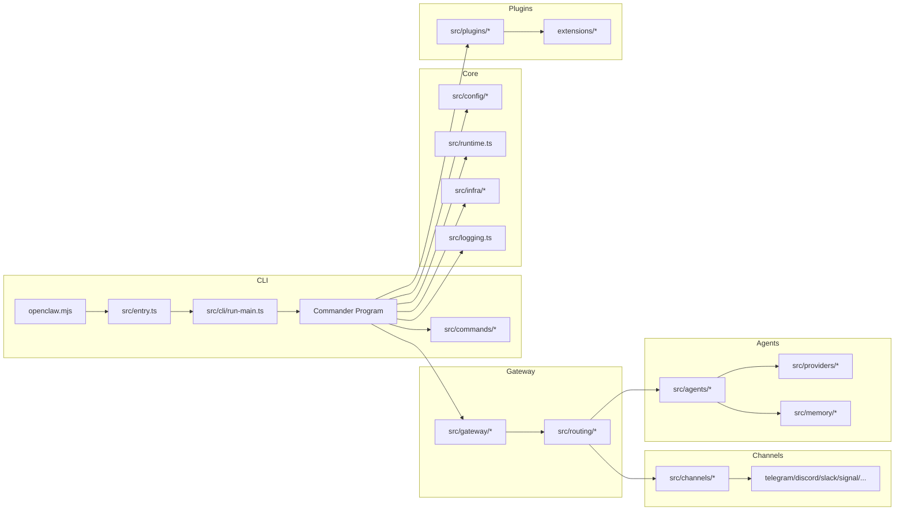

# OpenClaw 项目架构与技术栈（初版）

> 本文基于仓库结构、`package.json`、`src/entry.ts`、`src/index.ts`、`src/cli/run-main.ts`、`src/cli/program/*` 的已读内容整理；后续会随着深入阅读更新。

## 项目定位（已验证）
- 类型: Node.js/TypeScript 的 CLI + 网关服务（gateway）+ 多渠道消息接入 + 插件系统。
- 入口: `openclaw.mjs` -> `dist/entry.js`（构建产物） -> `src/entry.ts`（源码入口）。
- 运行时: Node >= 22（见 `package.json` engines）。
- CLI 框架: Commander（`src/cli/program/*`）。

## 技术栈（已验证）
- 语言: TypeScript (ESM)
- 运行: Node.js 22+
- CLI: `commander`
- Web/HTTP: `express`, `hono`, `ws`
- 渠道 SDK: `@whiskeysockets/baileys`(WhatsApp Web), `grammy`(Telegram), `@slack/bolt`/`@slack/web-api`, `discord-api-types`, `@line/bot-sdk`
- 媒体/文档: `sharp`, `pdfjs-dist`, `markdown-it`
- 任务/定时: `croner`
- 插件: `jiti`（运行时加载）

## 架构概览（推断，基于目录结构）
- CLI 层: `src/cli`, `src/commands`
- 网关层: `src/gateway`（HTTP/WS/会话/鉴权/通道编排）
- 渠道层: `src/channels` + `src/*` 各渠道实现（telegram/discord/slack/signal/imessage/web/whatsapp/line 等）
- 代理/模型层: `src/agents`, `src/providers`, `src/memory`, `src/tts`
- 配置/会话: `src/config`, `src/sessions`, `src/pairing`
- 基础设施: `src/infra`, `src/logging`, `src/terminal`, `src/process`, `src/security`
- 插件/扩展: `src/plugins`, `extensions/*`
- UI: `ui/`（前端构建），`apps/*`（macOS/iOS/Android）

## 架构图（Mermaid）

## 部署/运行形态（已验证）
- CLI: `openclaw` 命令行入口
- macOS app: `apps/macos` + `dist/OpenClaw.app`
- iOS/Android: `apps/ios`, `apps/android`
- Web UI: `ui/`

