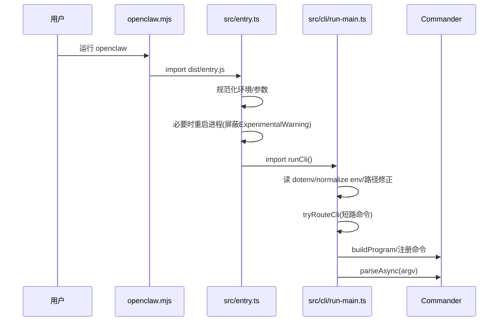
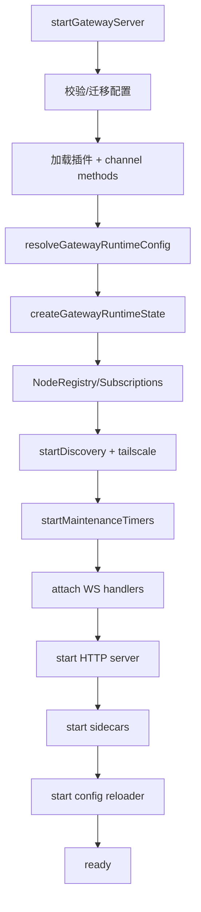
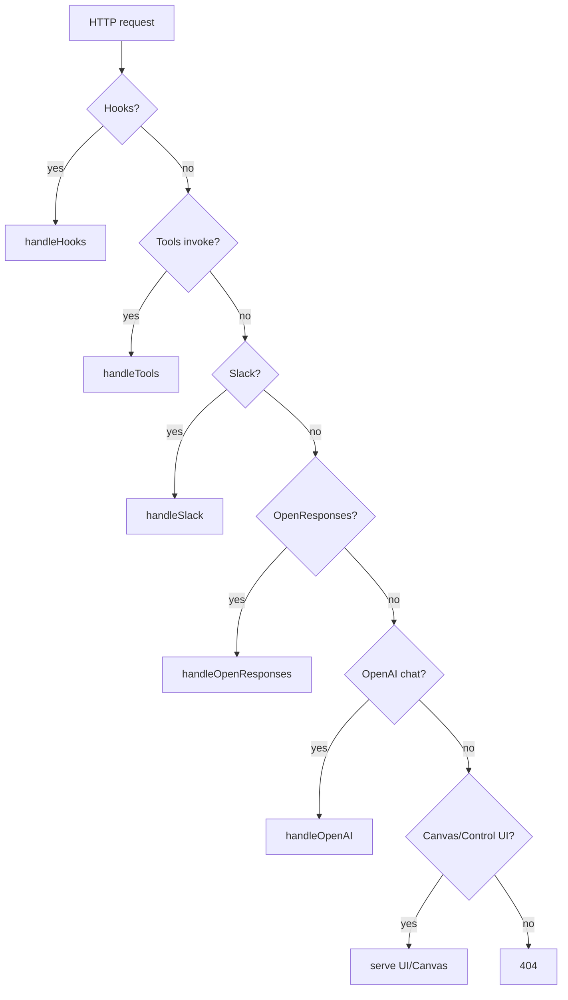
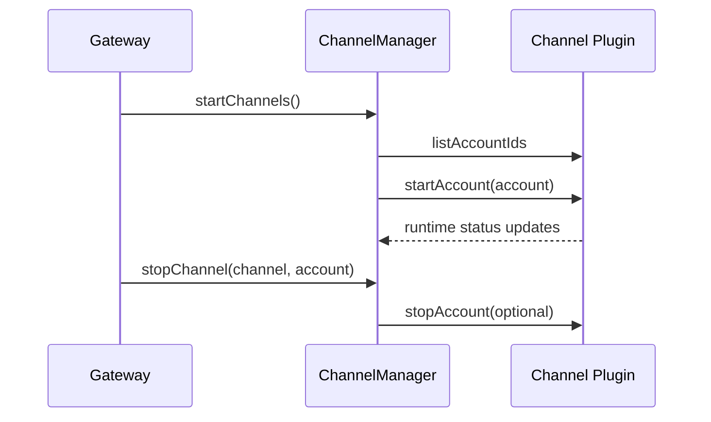
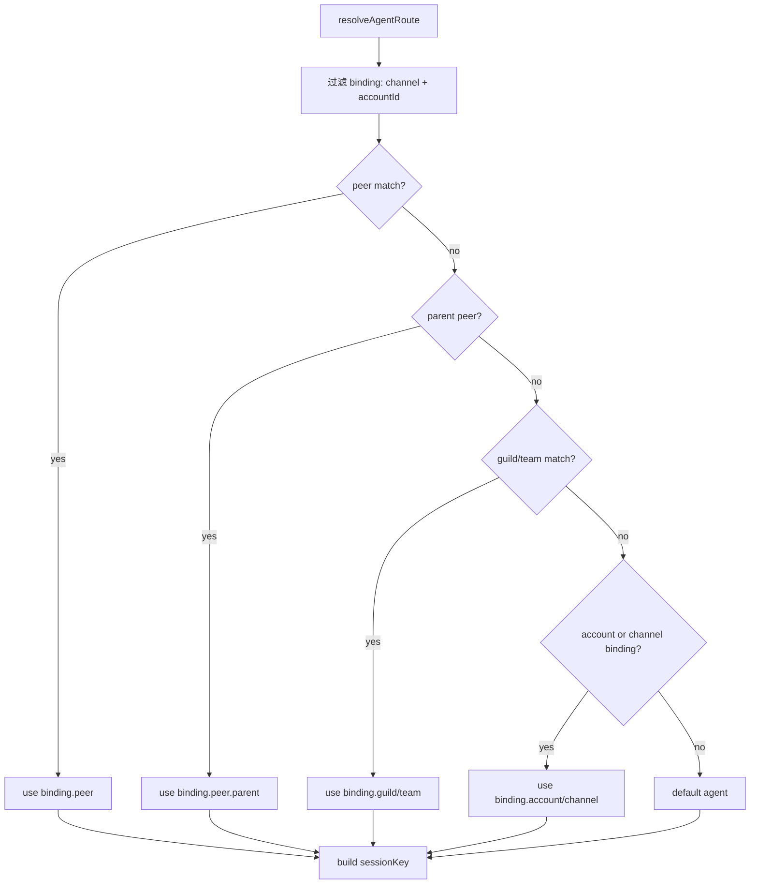
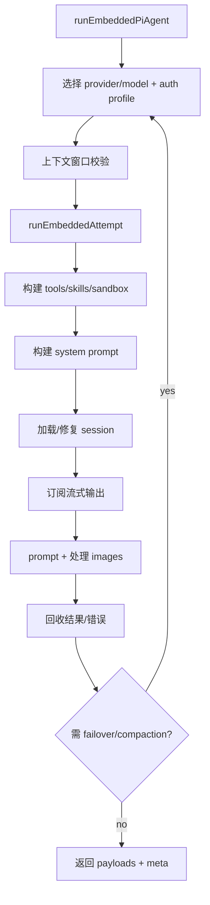

# 核心流程（更新版）

## 1) CLI 启动流程（已验证）
来源: `openclaw.mjs` -> `src/entry.ts` -> `src/cli/run-main.ts`

## 2) Gateway 启动流程（已验证）
来源: `src/gateway/server.impl.ts` + `src/gateway/server-startup.ts`

## 3) Gateway HTTP 请求处理（已验证）
来源: `src/gateway/server-http.ts`

## 4) Channel 生命周期（已验证）
来源: `src/gateway/server-channels.ts`

## 5) 路由与 session key（已验证）
来源: `src/routing/resolve-route.ts`

## 6) Agent 单次运行（已验证）
来源: `src/agents/pi-embedded-runner/run.ts` + `run/attempt.ts`

