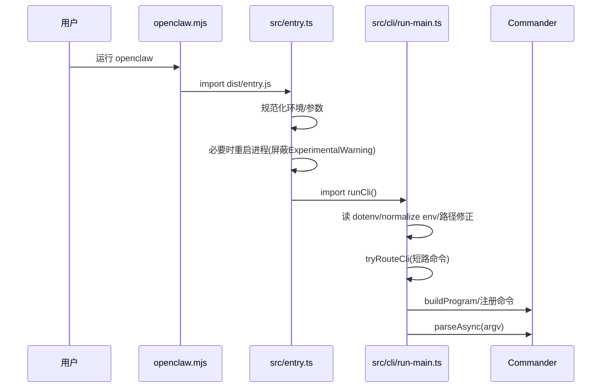
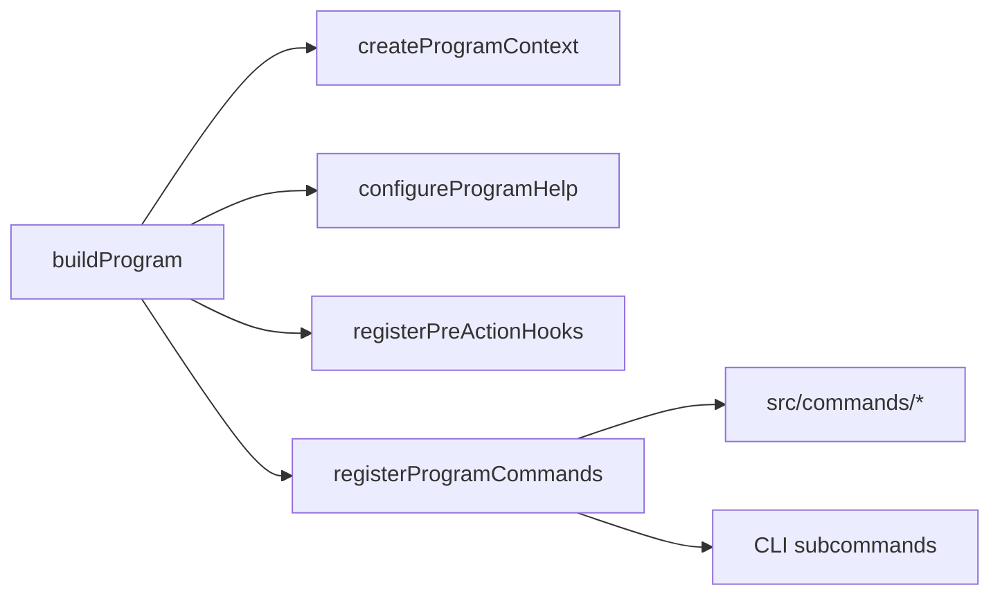
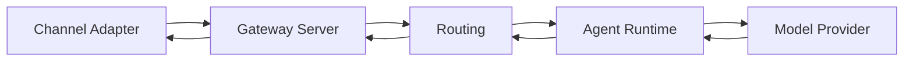
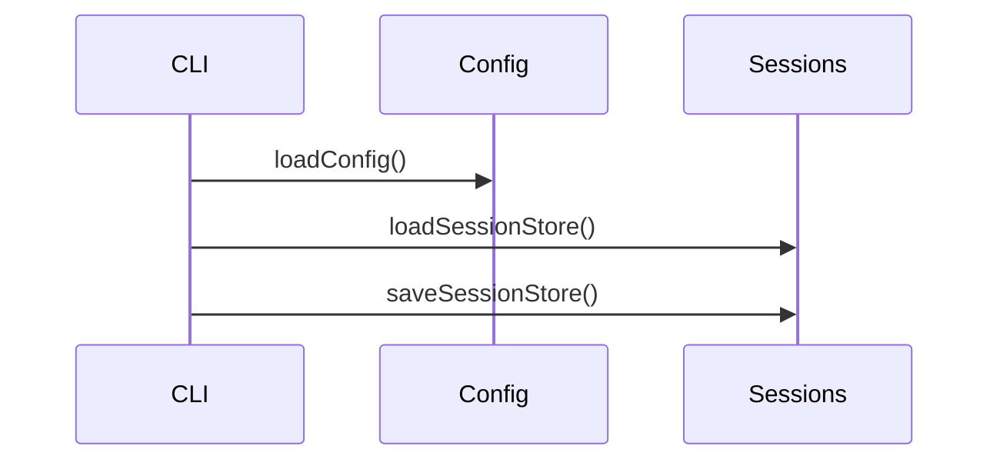

# 核心流程（初版）

> 标注“推断”的流程来自目录结构与命名推理，需在深入阅读后校准。

## 1) CLI 启动流程（已验证）
来源: `openclaw.mjs` -> `src/entry.ts` -> `src/cli/run-main.ts`

## 2) 命令注册与路由（已验证）
来源: `src/cli/program/*`, `src/cli/program/command-registry.ts`

## 3) 消息处理主链路（推断）
来源: 目录结构 `src/gateway`, `src/routing`, `src/channels`, `src/agents`, `src/providers`。

## 4) 配置/会话流程（推断）
来源: `src/config/*`, `src/sessions/*`, `src/commands/*`。

